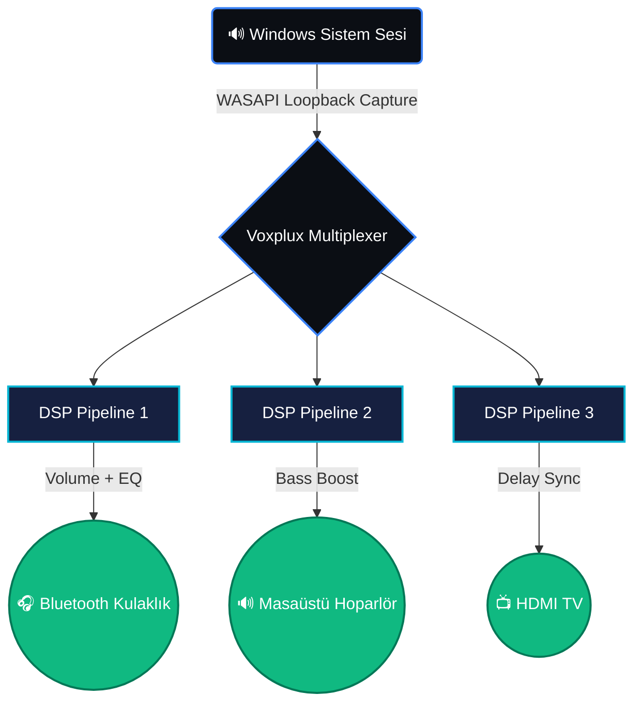

<p align="center">
  
</p>

<h3 align="center">
  <b>Sıradan Ses Deneyimini Kırın. Aynı Anda Her Yerde Olun.</b>
</h3>

<p align="center">
  <a href="https://git.io/typing-svg">
    
  </a>
</p>

<p align="center">
  <a href="https://dotnet.microsoft.com/"></a>
  <a href="https://learn.microsoft.com/wpf/"></a>
  <a href="https://github.com/naudio/NAudio"></a>
  <a href="LICENSE"></a>
</p>

---

## 🌌 Neden Voxplux?

Windows, yapısı gereği sesi yalnızca **tek bir çıkış cihazına** vermeye programlanmıştır. Kulaklığınız takılıysa hoparlör susar; hoparlör açıksa kulaklık iptal olur. 

**Voxplux (Vox: Ses + Plux: Çoğaltma)** bu duvarı yıkar.  
Oyun oynarken kulaklığınızdan kusursuz ses alırken, arkanızdaki ses sisteminden müziği odaya verebilirsiniz. Üstelik her bir cihazın **ses seviyesini, basını ve ekolaizer ayarlarını tamamen birbirinden bağımsız** kontrol ederek.

---

## 🚀 Sınırları Aşan Özellikler

| 🎛️ **Bölünmüş Kontrol** | ⚡ **Kusursuz Akış** | 🎚️ **Pro DSP Motoru** |
| :--- | :--- | :--- |
| **Aynı anda 4 çıkış:** Bluetooth, Jak, USB veya HDMI ayrımı yapmaksızın sesi klonlar. | **~20ms Gecikme:** WASAPI Loopback teknolojisi ile sıfır gecikme hissi. | **3-Bant EQ & Bass:** Her cihaz için Low/Mid/High ve Bass Boost kontrolü. |
| **Bağımsız Volüm:** Kulaklıkta %100, hoparlörde %20 ses seviyesi. | **Senkronizasyon:** Farklı cihazlar arası gecikmeyi milisaniyelik ayarla eşitleyin. | **Smooth Ramping:** Sesi aniden kesmez, "Click/Pop" patlamalarını engeller. |

---

## 🧠 Gelişmiş Mimari

Voxplux, arka planda karmaşık bir dijital sinyal işleme (DSP) ağı kurarak çalışır. Sistem sesi yakalandıktan sonra her bir aktif cihaz için özel bir tünel (Pipeline) oluşturulur.



---

## 💻 Kurulum ve Kullanım

<details>
<summary><b>🔥 Hızlı Başlangıç (Tek Tıkla Çalıştır)</b></summary>
<br>

En kolay yöntem! Herhangi bir yazılım veya `.NET` kurmanıza gerek yoktur.
1. **[Releases](../../releases)** sayfasından en güncel `Voxplux.App.exe` dosyasını indirin.
2. Dosyaya çift tıklayın ve kullanmaya başlayın!

</details>

<details>
<summary><b>🛠️ Geliştiriciler İçin (Kaynak Koddan)</b></summary>
<br>

Kendi bilgisayarınızda derlemek veya projeye katkıda bulunmak isterseniz:

```powershell
# Repoyu bilgisayarınıza klonlayın
git clone https://github.com/tariksnmz58/voxplux.git
cd voxplux

# Projeyi çalıştırın
dotnet run --project src/Voxplux.App

# Tek bir EXE dosyası olarak derlemek (Publish) için:
dotnet publish src/Voxplux.App -c Release -r win-x64 --self-contained true -p:PublishSingleFile=true -o publish
```
</details>

---

## 🎨 Arayüz (Mica Dark Theme)

Uygulama, Windows 11'in **Mica** materyalini kullanarak arka plandaki duvar kağıdınızın renklerini hafifçe emer. **Electric Blue** ve **Cyan** detaylarla bezenmiş arayüz, göz yormayan, premium bir "Quiet Luxury" tasarım dili sunar.

- **Otomatik Başlatma:** Sol menüden ilk cihazı aktifleştirdiğiniz an ses yakalama motoru otomatik devreye girer.
- **Canlı Geri Bildirim:** Alt kısımdaki durum çubuğu, kaç cihazın aktif olduğunu ve sistemin o anki durumunu bildirir.

---

<div align="center">

**Geliştirici:** [@tariksnmz58](https://github.com/tariksnmz58) &nbsp; | &nbsp; **Lisans:** [MIT](LICENSE)


</div>
